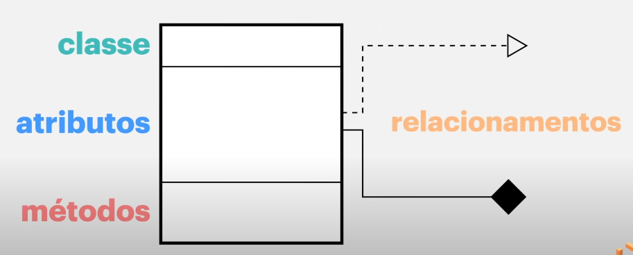

# Diagramas de classe

[Voltar](DiagramHome.md)

Diagrama de classe é um tipo de diagrama que apresenta para um programador todas classes,atributos e métodos de um projeto, onde podemos ver quais são as conexões e controles entre as classes de um programa.

Para construir um diagram desses precisamos entender os seguintes dados:



- __Classe__ : Uma classe é um modelo para criar um objeto, sendo esse objeto algo existente no nosso mundo. A classe define um conjunto de atributos e método que os objetos criados a partir da classe terão.

> [!IMPORTANT]  
> Um exemplo de classe bem conhecido é a classe Pessoa, onde podemos criar pessoas diferentes(objetos).

- __Atributos__ : Um atributo é uma propriedade ou característica de uma classe. Ele define o estado ou dados que os objetos da classe podem ter. Podemos definir quantos tipos de atributos forem necessários em diversos tipos diferentes (int,String,Boolean,etc...)

> [!IMPORTANT]  
> Um atributo famoso de uma Pessoa é o seu nome, onde é um atributo do tipo String.

- __Métodos__ : Um método é uma função ou operação que pode ser realizado pelo objeto da classe. Ele define o comportamento do que o objeto pode fazer.

> [!IMPORTANT]  
> Todas as pessoas precisam dormir, então uma ação de um objeto da classe Pessoa é dormir.

- __Permissões__ : Podemos definir como todas essas estruturas podem ser utilizadas em nosso código, onde temos as seguintes permissões:
  - __público (public)__ : As nossas classes, atributos e métodos podem ser utiizados por todo nosso projeto e externamente.
  - __privado (private)__ : As nossas classes, atributos e métodos somente são usados internamente em nossa classe.
  - __protegido (protected)__ : As nossas classes, atributos e métodos são alterados somente pode classes e subclasses relacionadas.

> [!IMPORTANT]  
> Devemos tomar cuidado com as permissões para não deixar aberto dados sigilosos.

- __Relacionamentos__ : Um relacionamento representa uma relação entre duas ou mais classes, podendo ser `unidirecional` (somente para um caminho) ou `bidirecional` (pode ser tanto dos dois lados). Existem alguns tipos de relacionamentos como explicado abaixo:
  - __Associação__ : A associação é o relacionamento mais básico e representa uma `conexão entre duas classes`.
  - __Agregação__ : A agregação é um tipo especial de associação que representa um relacionamento "todo ou parte", onde a `parte pode existir independente do todo`.
  - __Composição__ : A composição é uma forma mais forte de agregação, onde a parte `não pode existir sem o todo`. Se o todo for destruído, as partes também serão.
  - __Herança__ : A herança representa um relacionamento "é um", onde uma classe filha `herda atributos e métodos de uma classe pai`.
  - __Implementação__ : A implementação é um relacionamento entre uma `interface` e uma `classe` que implementa essa interface.

## De código para diagrama

---

Podemos ter o seguinte código (tanto em C# quanto em Java) que mostra os dados de uma pessoa

```csharp
// EM C#
public class Pessoa
{
    public string Nome { get; set; }
    public int Idade { get; set; }

    public void Falar()
    {
        // Funcionalidade do método
    }
}
```

```java
// EM JAVA
public class Pessoa {
    private String nome;
    private int idade;

    public String getNome() { return nome; }

    public void setNome(String nome) { this.nome = nome; }

    public int getIdade() { return idade; }

    public void setIdade(int idade) { this.idade = idade; }

    public void falar() {
        // Funcionalidade do método
    }
}
```

Queremos construir o diagrama inicial dessa classe utilizando o PlantUML, que é uma linguagem para criação de código como documentação.

Para isso devemos começar escrevendo a estrutura base da linguagem, onde iremos iniciar e fechar nosso diagrama usando __@startuml__ e __@enduml__ em um arquivo com a extenção `.plantuml`.

```text
@startuml

@enduml
```

Vamos criar agora a estrutura da nossa classe, onde colocamos a palavra reservada __class__ e o nome da nossa classe, depois abrimos e fechamos colchetes (`{}`).

```text
@startuml

class Pessoa {}

@enduml
```

Vamos colocar agora os atributos da nossa classe, sempre cuidando o tipo do dado e suas permissões, no exemplo do código temos a seguinte estrutura:

```text
@startuml

class Pessoa {
    -string nome // em C#
    -String nome // em Java
    -int idade
}

@enduml
```

No exemplo acima começamos a ver uma questão em relação as permissões, onde no PlantUML temos a seguinte organização:

- __+__ significa que o atributo é `Público`
- __-__ significa que o atributo é `Privado`
- __#__ significa que o atributo é `Protegido`

Essa regra também é utilizado nos métodos da classe, onde sabemos que são métodos quando inicia o nome com a letra maiuscula e finaliza com abre e fecha parenteses.

No exemplo do Java ele cria mais métodos (Getters e Setters) diferente em C# que não precisamos definir eles.

```text
// Exemplo em Java
@startuml                          

class Pessoa {
    -String nome
    -int idade

    +String getNome()
    +void setNome()
    +int getIdade()
    +void setIdade()
    +void falar()
}

@enduml

// Exemplo em C#
@startuml                          

class Pessoa {
    -string nome
    -int idade

    +void falar()
}

@enduml
```

Com essa estrutura já podemos criar nosso diagrama inicial dessa classe, outra coisa boa de fazer é separar informações usando comentários, onde utilizamos o símbolo __'__ para definir que essa linha é um comentário

```text
// Exemplo em Java
@startuml                          

' CLASSES

class Pessoa {

    ' Atributos
    ' ---------
    -String nome
    -int idade

    ' Métodos
    ' --------
    +String getNome()
    +void setNome()
    +int getIdade()
    +void setIdade()
    +void falar()
}

@enduml
```

Para criarmos o diagrama, podemos utilizar a extensão do VSCODE chamada __PlantUML__ e clicar em `Ctrl` + `Shift` + `P` e selecionar a opção _Preview Current Diagram_


Com isso criamos nossa primeira classe, agora vamos entender como elas se comunicam.

## Relacionamentos nos diagramas

---

No PlantUML temos como mostrar um relacionamento utilizando simbolos específicos como a seguinte tabela:

| Símbolo  | Relacionamento             |
| -------- | -------------------------- |
| -->      | Associação a direita       |
| <--      | Associação a esquerda      |
| <-->     | Associação bidirecional    |
| o--      | Agregação a esquerda       |
| --o      | Agregação a direita        |
| o--o     | Agregação bidirecional     |
| *--      | Composição a esquerda      |
| --*      | Composição a direita       |
| `*--*`   | Composição bidirecional    |
| <\|--    | Herança a esquerda         |
| --\|>    | Herança a direita          |
| <\|--\|> | Herança bidirecional       |
| <\|..    | Implementação a esquerda   |
| ..\|>    | Implementação a direita    |
| <\|..\|> | Implementação bidirecional |

### Exemplo de Associação

Vamos dizer que uma pessoa pode possuir um ou mais carros, para criar um diagrama devemos construir as classes e seus dados tanto da classe Pessoa quanto da classe Carro:

```md
class Pessoa {
    -string nome 
    -int idade 

    +string getNome()
    +void falar()
    +int getIdade()
}

class Carro {
    +Pessoa pessoa
    +string placa

    +string getNomePessoa()
    +string getPlaca()
}
```

Agora vamos conectar essas duas classes onde a ideia de relação é que uma pessoa __Possui__ um ou mais carros, para isso a seta da associação tem que ir da classe Pessoa para a classe Carro como no exemplo abaixo:

```md
Pessoa --> Carro
```

Podemos colocar uma mensagem de texto na relação onde somente colocamos __:__ e depois o texto:

```md
Pessoa --> Carro : possui
```

Se queremos colocar __proporção__ entre as classes (como por exemplo uma pessoa pode ter nenhum ou muitos carros) colocamos a proporção entre aspas duplas de cada lado.

```md
Pessoa "1" --> "0..*" Carro : possui
```

- __"1"__ significa que uma pessoa

- __"0..*"__ significa que pode ser zero ou mais carros

Com essa descrição, agora podemos construir nosso código comentando e separando cada parte para ficar bem estruturado e com isso criar a relação entre as classes:


