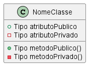
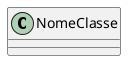

# Criando diagramas usando UML

[Página Inicial](../Home.md)


Podemos criar diagramas UML de diversos tipos escrevendo código utilizando um programa chamado **PlantUML**.

## Diagrama de classe

Diagrama de classe é um tipo de diagrama que apresenta para um programador todas classes,atributos e métodos de um projeto, onde podemos ver quais são as conexões e controles entre as classes de um programa.

Para construir um diagram desses precisamos entender os seguintes dados:


- __Classe__ : É uma estrutura que engloba vários detalhes de um todo, uma classe serve para podermos organizar informações de algo em um único objeto (Ex: Cachorro)

- __Atributos__ : São os dados que a minha classe possui, podendo ser `publicos` (pode ser acessado por outras classes) e `privados` (somente é utilizado dentro dessa classe) (Ex: Rabo).

- __Métodos__ : São blocos de código que fazem algo com a minha classe, como uma `ação que vai ser ativada` quando utilizamos um objeto dessa classe (Ex: Latir);

- __Relacionamentos__ : Podemos conectar classes, onde podemos definir como cada classe faz parte de um todo que se reutilizam ou necessitam uma das outras.

## Utilizando PlantUML

Agora que entendemos como funciona teoricamente um diagrama de classe, vamos ver o seguinte exemplo:

<center>

</center>

Vamos pegar cada detalhe como um código utilizando a estutura do PlantUML.

### 1. Iniciando um arquivo plantUML

Primeiro, devemos criar um arquivo com a extensão `.plantuml` e abrir e fechar uma estrutura onde começa o código do UML (`@startuml`) e finaliza o código do UML (`@enduml`).

```text
@startuml Nome do Diagrama

@enduml
```

### 2. Criando uma classe vazia

Agora, podemos criar nossa classe, onde simplesmente temos que colocar a palavra `class` e depois o nome da nossa classe:

```text
class NomeClasse {

}
```

Por enquanto não tem nenhum atributo ou método, mas isso deve ser colocado dentro da estrutura do `@startuml` e `@enduml`.

```text
@startuml Exemplo Diagrama

class NomeClasse{
   
}

@enduml
```

Aqui podemos ver como está ficando gerado:


