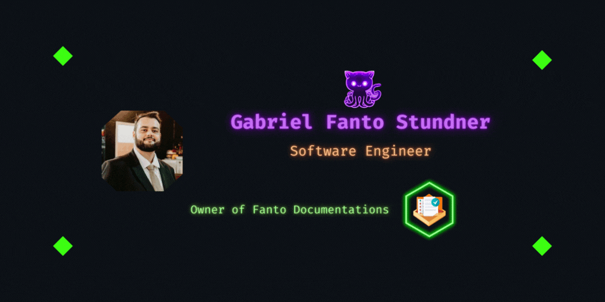

# Bem vindos

Sou **Engenheiro de Software com 6 anos de experiência** em desenvolvimento de soluções robustas e escaláveis. 

Minha expertise inclui tecnologias como **.NET com Csharp**, **Java com Spring Boot** e criação de **scripts eficientes com Python**. 

Autodidata por natureza, estou sempre em busca de novos conhecimentos e habilidades para aprimorar meu trabalho e entregar resultados de alta qualidade.

Ao longo da minha carreira, participei de diversos projetos que exigiram não apenas habilidades técnicas, mas também uma forte capacidade de resolução de problemas e trabalho em equipe. 

Tenho experiência em metodologias ágeis, como Scrum e Kanban, o que me permite adaptar rapidamente às mudanças e garantir entregas contínuas e eficientes.

Além disso, possuo um sólido entendimento de princípios de design de software, padrões de arquitetura e melhores práticas de codificação. Minha paixão por tecnologia e inovação me motiva a estar sempre atualizado com as últimas tendências e ferramentas do mercado.

Estou comprometido com a excelência e a melhoria contínua, buscando sempre superar as expectativas e contribuir de forma significativa para o sucesso dos projetos em que estou envolvido.

## Minhas documentações

---

- [Utilizando PlantUML para gerar diagramas como código](docs/diagrams/DiagramHome.md)

## Meus projetos

---

- [Gerador de projetos .NET via console](https://github.com/F4NT0/CSharp-Template)
